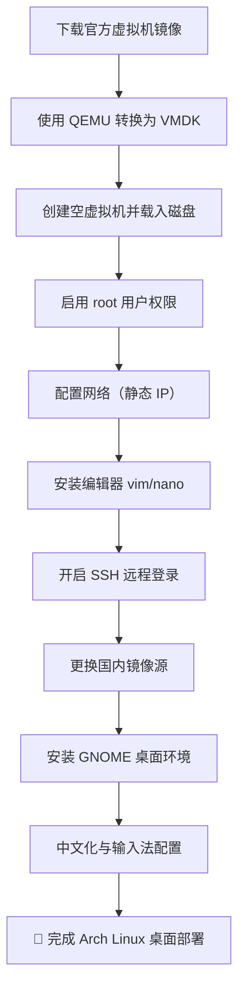

# 🧩 Arch Linux Installation Guide / Arch Linux 安装指南

适用对象：  
想学习 **Arch Linux 从零安装** 的用户，以及希望快速部署无多余操作的虚拟机用户。

运行环境：  
建议在 **VMware / VirtualBox / QEMU** 等虚拟机中操作。

---

## 🗺️ 安装流程图 / Installation Flow



---

## 🌀 Step 1: 获取官方虚拟机镜像 / Download Official VM Image

**镜像下载：** [https://fastly.mirror.pkgbuild.com/images/](https://fastly.mirror.pkgbuild.com/images/)

若镜像为 `.qcow2` 格式，VMware 无法直接使用，可通过 `qemu-img` 转换为 `.vmdk`。

```bash
# 安装 QEMU
sudo pacman -S qemu

# 转换磁盘格式
qemu-img convert -f qcow2 -O vmdk your_disk.qcow2 your_disk.vmdk

# 示例
qemu-img convert -f qcow2 -O vmdk E:\VM_ROOT\ROOT_Other\Arch.qcow2 E:\VM_ROOT\ROOT_Other\Arch.vmdk
```

然后：
1. 打开 VMware，新建空白虚拟机；
2. 将生成的 `.vmdk` 文件替换虚拟机目录内原磁盘即可启动。

---

## 🔐 Step 2: 启用 root 账户 / Enable root account

```bash
sudo passwd root    # 设置 root 密码，例如 root
su                  # 切换到 root 用户
```

---

## 🌐 Step 3: 网络配置 / Configure Network (Static IP)

系统默认通过 DHCP 获取地址。  
若希望固定 IP，可清理旧文件并新建配置：

```bash
rm -f /etc/systemd/network/*.network
```

创建文件 `/etc/systemd/network/20-wired.network`：

```bash
tee /etc/systemd/network/20-wired.network > /dev/null <<'EOF'
[Match]
Name=eth0
[Network]
Address=192.168.10.192/24
Gateway=192.168.10.2
DNS=223.5.5.5
DNS=114.114.114.114
DNS=8.8.8.8
EOF
```

**应用配置并测试：**
```bash
systemctl restart systemd-networkd
systemctl restart systemd-resolved
ln -sf /run/systemd/resolve/resolv.conf /etc/resolv.conf
ping archlinux.org
```

---

## 📝 Step 4: 安装编辑器 / Install Editor

```bash
sudo pacman-key --init
sudo pacman-key --populate archlinux
sudo pacman -Sy archlinux-keyring
sudo pacman -S vim nano
```

---

## 🔑 Step 5: 启用 SSH 登录 / Enable SSH Root Login

编辑配置文件：
```bash
sudo nano /etc/ssh/sshd_config
```
修改如下：
```
PasswordAuthentication yes
PermitRootLogin yes
```

重启 SSH：
```bash
sudo systemctl restart sshd
```

> 💡 **Xshell SSH 提示：**  
> 若右键粘贴变为 *Visual 模式*，使用 **Shift + 右键** 或 **Shift 双击右键** 再选择粘贴。

---

## 🚀 Step 6: 换国内镜像源 / Switch to China Mirrors

手动修改：
```bash
sudo vim /etc/pacman.d/mirrorlist
```
示例：
```
Server = https://mirrors.jxust.edu.cn/archlinux/$repo/os/$arch
```

使用 `reflector` 自动选择最新国内源：
```bash
sudo pacman -S reflector
sudo reflector \
    --country China \
    --protocol https \
    --latest 3 \
    --save /etc/pacman.d/mirrorlist

sudo pacman -Syu
```

---

## 💻 Step 7: 安装 GNOME 桌面 / Install GNOME Desktop

```bash
sudo pacman -Syy
sudo pacman -Syu
sudo pacman -Scc
sudo pacman -S xorg gnome
systemctl enable gdm
reboot
```

重启后进入图形化桌面。

---

## 🇨🇳 Step 8: 中文支持 / Localization (Chinese Support)

编辑语言文件：
```bash
sudo vim /etc/locale.gen
# 取消以下注释：
zh_CN.UTF-8 UTF-8
zh_TW.UTF-8 UTF-8
```

生成语言并设置系统环境：
```bash
sudo locale-gen
echo "LANG=zh_CN.UTF-8" | sudo tee /etc/locale.conf
```

安装中文字体与输入法：
```bash
sudo pacman -S noto-fonts-cjk
sudo pacman -S fcitx5-im fcitx5-chinese-addons fcitx5-rime

echo -e "GTK_IM_MODULE=fcitx\nQT_IM_MODULE=fcitx\nXMODIFIERS=@im=fcitx" | \
sudo tee -a /etc/environment
reboot
```

---

## ✅ 完成 / Done!

🎉 你现在拥有一个完整可用的 **Arch Linux + GNOME 中文桌面环境**！  

此配置方案轻量、易复现，非常适合学习 Arch 基础及桌面环境部署。
